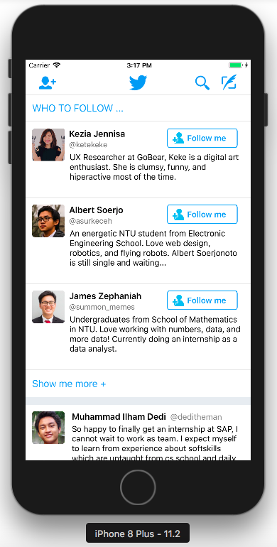
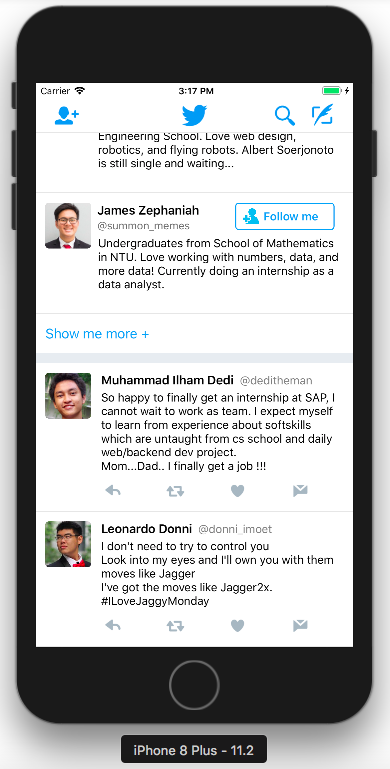
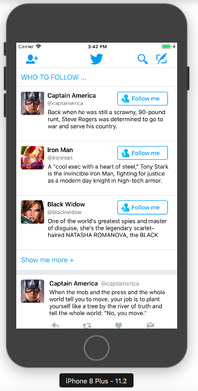
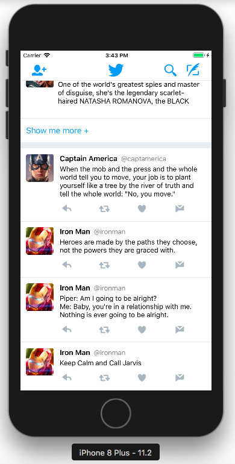

# Twitter App 
 Twitter application clone, a popular social media application that is used by millions worldwide. Prophecy says US president will one day start a war using this social media XD. Meanwhile, keep calm and keep twitting ...

<p>

</p>
<p>

</p>

## PROJECT REQUIREMENTS

- iOS 11.0+
- Xcode 8.3+
- Swift 4.0+

## DEPENDENCIES INSTALLATION
The whole twitter clone is build on top of LBTA Components by @BrianVong. It includes SwiftyJSON, an elegant framework to deal with everything JSON. In addition, we need to install TRON, a Swift framework for lightweight network abstraction layer.

Using [Pods](http://cocoapods.org) we can specify all dependencies in `Podfile`:

```ruby

target 'twitter-app' do
  use_frameworks!

  # Pods for twitter-app
	pod 'LBTAComponents', '~>1.0.2'
	pod 'TRON', '~> 4.0'
end
```

Then, run the following command:

```bash
$ pod install
```

## Twitter-App: What this project does :

#### UX/UI
- **Datasource Controll** Think of using LBTA Components as UICollectionViewController on steroids. No longer do we have to register cells with their own ids. Providing a simple subclass of Datasource will render out the list data to our **UX/UI** view.
- **Cache Image** Loading images and caching them is quite tedious. However, LBTA Component frameworks does the dirty work for us. This twitter-app use basic implementations that I'm providing.
- **View Layout-Constraint**  Let's face it, the amount of code required to place views onto the screen isn't great. Using LBTA Components, we can anchor any view to any other view with just one line of code, just like what is implemented in this social media clone, the twitter-app

#### Network Request & Data
- **TRON** - another steroid, this one is for network request handling to api or cloud server. With TRON, no more messing around with Curl and error handling. Everything is handled smoothly for us.  
- **SwiftJSON** - handles JSON object, parsing and transform. Also handles data conversion from JSON file to anytype we want as convenient as we can.

#### API
  -  Uses API: "https://api.letsbuildthatapp.com" by @BrianVong which nothing but a dummy data for my twitter feeds & profile picture


